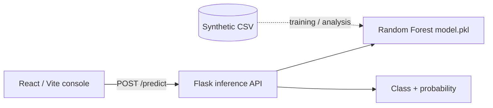
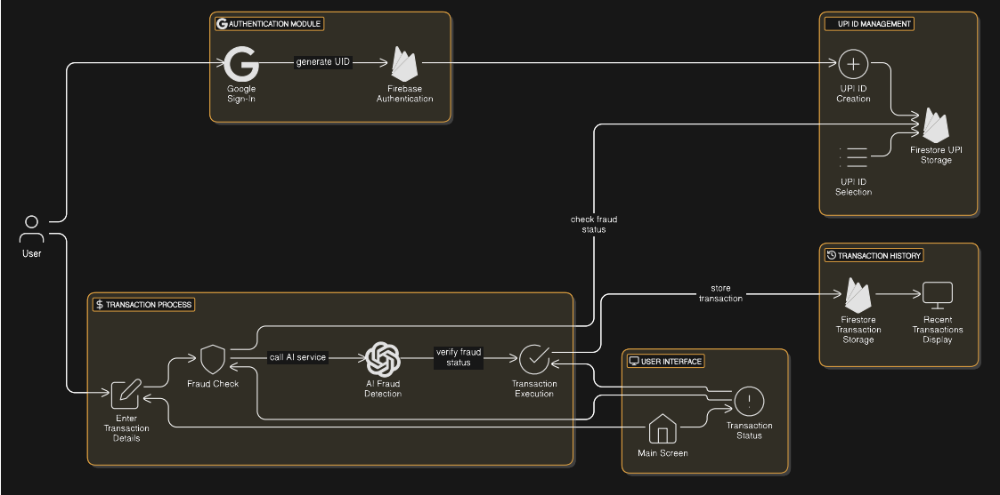
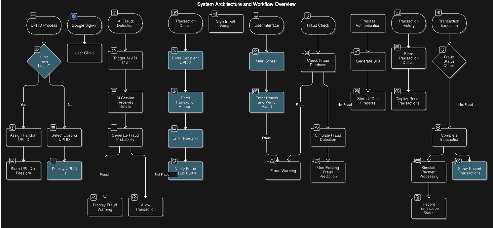

# SafePayAI — payment fraud detection demo

SafePayAI is a small, end-to-end demonstration of transaction risk scoring. It bundles a synthetic dataset, a trained scikit-learn Random Forest model, a Flask inference API, and a React/Vite console for sending feature vectors to the API.

> **Scope:** this is a research and portfolio demo, not a production payment control. The dataset is synthetic, the model artifact is serialized with pickle, and no authentication, persistence, monitoring, or payment execution is included.

## What changed in this version

- Replaced the missing Vite entrypoint with a working React client.
- Added a validated `/predict` API that returns both a class and class probabilities.
- Added `/health` and `/model-info` endpoints for simple operational checks.
- Normalized the model artifact name to `model.pkl` and made its path configurable with `MODEL_PATH`.
- Added API tests for input validation and response shape.
- Added a reproducible Python training entry point in `scripts/train_model.py`.
- Added a reusable JavaScript API client in `src/api.js`.
- Documented the actual model contract instead of referring to non-existent `train.py`, `main.py`, or PostgreSQL services.

## Language statistics

The repository contains both Python and JavaScript source. GitHub is configured through
`.gitattributes` to count the Jupyter notebooks as Python source while excluding the
committed CSV, pickle, image, and PDF artifacts from language percentages. This keeps
the language panel focused on maintainable code rather than the size of generated or
binary files.

## Architecture



The repository also includes the original system and workflow diagrams:





## Dataset and model contract

The committed CSV contains **20,000 synthetic rows**, **20 input columns**, two categorical columns, and a `Label` target with an even 10,000 / 10,000 class split. The serialized model expects **22 numeric features**: the original numeric signals plus one-hot encoded categorical values.

The order is available from `GET /model-info` and is reproduced in the frontend:

1. Transaction amount
2. Transaction frequency
3. Recipient blacklist status
4. Device fingerprinting
5. VPN or proxy usage
6. Behavioral biometrics
7. Time since last transaction
8. Social trust score
9. Account age
10. High-risk transaction times
11. Past fraudulent behavior flags
12. Location-inconsistent transactions
13. Normalized transaction amount
14. Transaction context anomalies
15. Fraud complaints count
16. Merchant category mismatch
17. User daily limit exceeded
18. Recent high-value transaction flags
19. Recipient verification status: suspicious
20. Recipient verification status: verified
21. Geo-location flag: normal
22. Geo-location flag: unusual

The current artifact was created with scikit-learn 1.5.2. The pinned dependency is intentional because loading serialized scikit-learn estimators across versions can be unsafe or incompatible. Only load model files from a trusted source.

## Run locally

### 1. Start the API

```bash
python3 -m venv .venv
source .venv/bin/activate
pip install -r requirements.txt
python app.py
```

The API listens on `http://127.0.0.1:5000` by default.

### 2. Start the web client

In a second terminal:

```bash
npm install
npm run dev
```

If the API runs somewhere else, set the Vite variable before starting the client:

```bash
VITE_API_URL=http://localhost:5000 npm run dev
```

### 3. Try the API directly

```bash
curl http://localhost:5000/health
curl http://localhost:5000/model-info
curl -X POST http://localhost:5000/predict \
  -H 'Content-Type: application/json' \
  -d '{"features":[0.007772,0.461538,0,0,0,0.119084,0.794263,0.172174,0.786936,0,0,0,0.414003,0.186907,0,0,0,0,0,1,1,0]}'
```

Example response shape:

```json
{
  "prediction": 0,
  "label": "legitimate",
  "probability": {"0": 0.83, "1": 0.17},
  "fraud_probability": 0.17
}
```

## Development checks

```bash
npm run lint
npm run build
pytest -q
```

To retrain a separate joblib pipeline from the committed synthetic data:

```bash
python scripts/train_model.py \
  --data fraud_dataset_Generator_using_numpy.csv \
  --output artifacts/fraud_model.joblib
```

## Repository map

| Path | Purpose |
| --- | --- |
| `app.py` | Flask API and input validation |
| `src/` | React/Vite client |
| `src/api.js` | Shared browser API client |
| `scripts/train_model.py` | Reproducible preprocessing and Random Forest training |
| `model.pkl` | Existing trained Random Forest artifact |
| `fraud_dataset_Generator_using_numpy.csv` | Synthetic dataset used by the notebooks |
| `DataSetGeneratorUSingNumpy.ipynb` | Dataset generation exploration |
| `FraudDetectionUSingGAN.ipynb` | Preprocessing and modeling exploration |
| `tests/` | API regression tests |
| `SystemDesign.png`, `WorkFlowDiagram.png` | Existing design visuals |

## Limitations and next steps

For a production-oriented implementation, retrain from a reproducible script or pipeline, persist preprocessing with the estimator, use a safer model registry format, add authentication and rate limiting, log model/version metadata, evaluate on a time-based holdout, monitor drift and calibration, and introduce human review for high-risk decisions. Do not change the synthetic data merely to improve headline metrics; publish evaluation methodology and dataset provenance alongside any new result.

## License

See [LICENSE](LICENSE).
